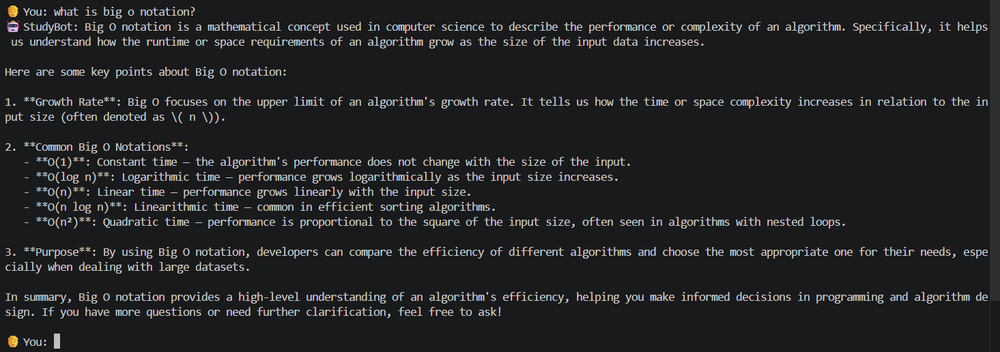
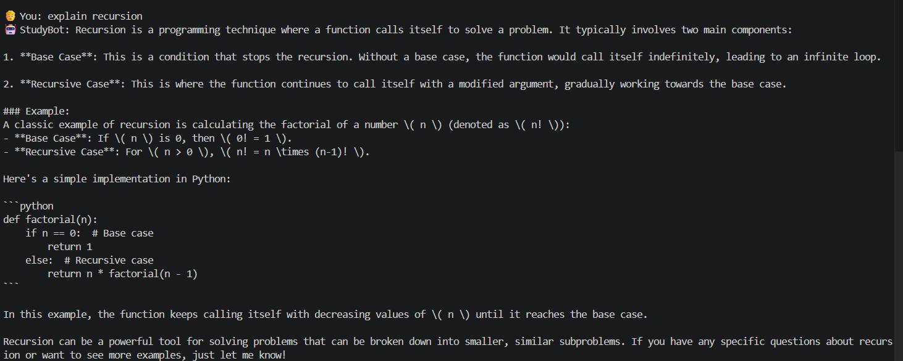
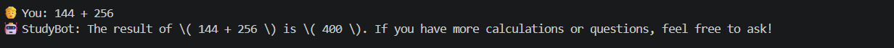

# 📚 AI Study Assistant — LangChain + TypeScript

A full-featured AI study chatbot built with **LangChain**, **TypeScript**, and **OpenAI GPT-4o-mini**, demonstrating the core building blocks of modern AI applications: Chains, Memory, Agents, Tools, and LangSmith Debugging.

---

## Demo Screenshots

### Explaining Concepts (Chain + Agent)


### Multi-turn Conversation with Memory


### Calculator Tool (Agent picks the right tool)


---

## What Problem Does LangChain Solve?

Raw LLM APIs give you one thing: send text → get text back. But real AI apps need:

| Problem | LangChain Solution |
|---|---|
| Complex prompt management | `ChatPromptTemplate` with variables |
| Chaining multiple LLM calls | `RunnableSequence` (LCEL) |
| Remembering conversation history | `RunnableWithMessageHistory` |
| Letting AI use tools / take actions | `AgentExecutor` with tools |
| Debugging what the AI actually did | **LangSmith** tracing |

---

## Features

- **Chains** — compose prompt → model → parser into reusable pipelines
- **Sequential Chains** — feed output of one chain into the next (explain → quiz)
- **Structured Output** — force the model to return typed JSON validated by Zod
- **Memory** — persist conversation history across multiple turns, isolated per session
- **Agents** — LLM dynamically decides which tools to call based on the question
- **Custom Tools** — calculator, topic explainer, study tips
- **LangSmith Tracing** — every LLM call, tool invocation, and error is recorded

---

## Project Structure

```
src/
├── index.ts        ← Interactive chatbot (main app — run this)
├── demo.ts         ← Automated demo of all features (no input needed)
├── chains.ts       ← Chain patterns: simple, sequential, structured output
├── memory.ts       ← Memory: buffer memory and multi-session isolation
├── agent.ts        ← Agent with tool-calling and reasoning steps
├── langsmith.ts    ← LangSmith traceable() wrappers and error tracing demo
├── tools.ts        ← Custom tools: calculator, topic explainer, study tips
├── models.ts       ← Model setup (OpenAI / Anthropic switchable)
└── config.ts       ← Environment validation + LangSmith config printer

screenshots/
├── demo-big-o-notation.png   ← Chatbot explaining Big O notation
├── demo-recursion.png        ← Chatbot explaining recursion with code
└── demo-calculator.png       ← Agent using calculator tool
```

---

## Setup

### 1. Clone and install

```bash
git clone https://github.com/PoorvaJawale/AI-Study-Assistant-.git
cd AI-Study-Assistant-
npm install --legacy-peer-deps
```

### 2. Configure environment

```bash
cp .env.example .env
```

Open `.env` and fill in your keys:

```env
# OpenAI API key — get one at https://platform.openai.com/api-keys
OPENAI_API_KEY=sk-...

# LangSmith — free at https://smith.langchain.com
LANGCHAIN_TRACING_V2=true
LANGCHAIN_API_KEY=ls__...
LANGCHAIN_PROJECT=langchain-ts-assistant

# Model provider (openai or anthropic)
MODEL_PROVIDER=openai
```

### 3. Run

```bash
# Interactive chatbot (full app):
npm run dev

# Automated demo — no typing needed:
npm run demo

# Individual feature modules:
npm run chains    # Chains demonstration
npm run memory    # Memory demonstration
npm run agent     # Agent demonstration
```

---

## How It Works

### Chains

A chain is a pipeline that connects a prompt template → model → output parser. The key abstraction is **LCEL (LangChain Expression Language)** which uses the `|` pipe operator:

```typescript
const chain = prompt.pipe(model).pipe(new StringOutputParser());
const result = await chain.invoke({ topic: "recursion" });
```

**Sequential chains** pass the output of one chain as input to the next:

```typescript
const sequentialChain = RunnableSequence.from([
  explainChain,                                          // Step 1: explain the topic
  (explanation) => quizChain.invoke({ explanation }),    // Step 2: create a quiz from it
]);
```

**Structured output** forces the model to return typed JSON using Zod:

```typescript
const StudyPlanSchema = z.object({
  topic: z.string(),
  difficulty: z.enum(["beginner", "intermediate", "advanced"]),
  key_concepts: z.array(z.string()),
});
const structuredModel = model.withStructuredOutput(StudyPlanSchema);
```

---

### Memory

Without memory, every LLM call is stateless. `RunnableWithMessageHistory` injects conversation history automatically into each prompt:

```typescript
const chainWithHistory = new RunnableWithMessageHistory({
  runnable: chain,
  getMessageHistory: (sessionId) => getOrCreateHistory(sessionId),
  inputMessagesKey: "input",
  historyMessagesKey: "history",
});

// Turn 1
await chainWithHistory.invoke({ input: "I'm studying TypeScript" }, { configurable: { sessionId: "alice" } });

// Turn 2 — history from Turn 1 is automatically injected
await chainWithHistory.invoke({ input: "What should I focus on?" }, { configurable: { sessionId: "alice" } });
```

Each session ID gets **isolated memory** — different users don't share context.

---

### Agents

Agents are different from chains: instead of a fixed pipeline, the **LLM decides at runtime** which tools to call and in what order.

```
User: "What is 144 + 256?"
  → Agent thinks: "This is a math question, I should use the calculator tool"
  → Calls: calculator({ expression: "144 + 256" })
  → Gets: "The result of 144 + 256 = 400"
  → Returns answer to user
```

```typescript
const agent = createToolCallingAgent({ llm: model, tools: allTools, prompt });
const executor = new AgentExecutor({ agent, tools: allTools, maxIterations: 5 });
```

**Custom tools** are simple TypeScript functions wrapped with LangChain's `tool()`:

```typescript
const calculatorTool = tool(
  async ({ expression }) => {
    const result = Function(`"use strict"; return (${expression})`)();
    return `The result of ${expression} = ${result}`;
  },
  {
    name: "calculator",
    description: "Evaluates mathematical expressions. Use for any calculations.",
    schema: z.object({ expression: z.string() }),
  }
);
```

---

### LangSmith Tracing

LangSmith is LangChain's observability platform. It records every step of your AI app as a **trace** — a tree of spans.

**What you can see in LangSmith:**

| Without LangSmith | With LangSmith |
|---|---|
| "The agent gave a wrong answer" — no idea why | See exactly which tool was called and what it returned |
| Can't see what prompt was actually sent | Full prompt with injected history visible |
| No idea how many tokens were used | Token count and cost per call |
| Error message only | Full error context at the exact failing step |

**Enable it** by setting in `.env`:
```env
LANGCHAIN_TRACING_V2=true
LANGCHAIN_API_KEY=ls__your-key
LANGCHAIN_PROJECT=langchain-ts-assistant
```

All LangChain chains and agents are **automatically traced**. For custom functions, wrap with `traceable()`:

```typescript
import { traceable } from "langsmith/traceable";

const generateStudyPlan = traceable(
  async (topic: string) => {
    // ... your code
  },
  { name: "generate_study_plan", run_type: "chain" }
);
```

**Example trace tree in LangSmith:**
```
homework_session (chain) — 3.2s
├── generate_study_plan (chain) — 1.8s
│   └── ChatOpenAI — 1.7s  [prompt: 85 tokens, completion: 210 tokens]
└── evaluate_student_answer (chain) — 1.4s
    └── ChatOpenAI — 1.3s  [prompt: 120 tokens, completion: 45 tokens]
```

---

## Architecture

```
User Input
    │
    ▼
┌─────────────────────────────────────────┐
│            Agent Executor               │
│                                         │
│  LLM (GPT-4o-mini)                      │
│   ↓ decides which tool(s) to call       │
│  ┌───────────┬─────────────┬─────────┐  │
│  │Calculator │TopicExplnr  │StudyTip │  │
│  └───────────┴─────────────┴─────────┘  │
│   ↓ tool results fed back to LLM        │
│  Final Answer Generation                │
└─────────────────────────────────────────┘
    │
    ▼
Chat History (Memory — per session)
    │
    ▼
LangSmith Trace (every step recorded)
```

---

## Tech Stack

| Technology | Version | Purpose |
|---|---|---|
| TypeScript | ^5.5 | Type-safe development |
| LangChain | ^0.3 | Chains, agents, memory |
| @langchain/openai | ^0.3 | OpenAI GPT integration |
| @langchain/anthropic | ^0.3 | Claude integration (optional) |
| LangSmith | ^0.2 | Tracing and debugging |
| Zod | ^3.23 | Structured output schema validation |
| Node.js | ≥18 | Runtime |

---

## Commands Reference

| Command | Description |
|---|---|
| `npm run dev` | Start interactive Study Assistant chatbot |
| `npm run demo` | Run automated demo of all features |
| `npm run chains` | Demonstrate chain patterns |
| `npm run memory` | Demonstrate memory patterns |
| `npm run agent` | Demonstrate agent with tools |

**In the chatbot (`npm run dev`):**
- Type any question to get an answer
- `history` — show conversation memory for this session
- `clear` — reset memory
- `exit` — quit

---

## Key Concepts Recap

| Concept | What it is | When to use |
|---|---|---|
| **Chain** | Fixed pipeline: prompt → model → parser | Predictable, structured workflows |
| **Sequential Chain** | Chain A output feeds Chain B | Multi-step transformations |
| **Memory** | Injects stored history into each prompt | Multi-turn conversations |
| **Agent** | LLM dynamically picks which tools to call | Open-ended, unpredictable tasks |
| **Tool** | A typed function the agent can invoke | Calculator, search, database, API calls |
| **LangSmith** | Records every execution step as a trace | Debugging, cost tracking, evaluation |

---

## License

MIT
